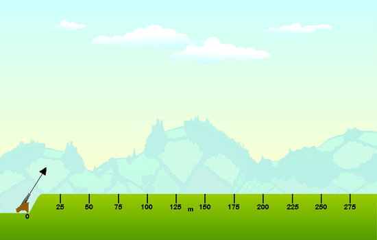
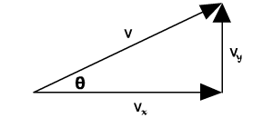

## Theory

### Projectile Motion

  

 

Projectile is defined as, any body thrown with some initial velocity, which is then allowed to move under the action of gravity alone, without being propelled by any engine or fuel. The path followed by a projectile is called its trajectory. A projectile moves at a constant speed in the horizontal direction while experiencing a constant acceleration of 9.8 m/s2 downwards in the vertical direction. To be consistent, we define the up or upwards direction to be the positive direction. Therefore the acceleration of gravity is, -9.8 m/s2.

### Horizontal motion of projectile
 

The speed in the horizontal direction is $V_{x}$' and this speed doesn't change. The equation which predicts the position at any time in the horizontal direction is simply,

$$X=V_{x}t$$

### Vertical motion of projectile
 

Because gravity has a downward pull, the vertical velocity changes constantly. The equation that predicts the vertical velocity at any time $V_{y}$ is

$$V_{y}=V_{oy}+at$$

The $V_{oy}$ is simply the original velocity in the vertical or y-direction.

To calculate the position in the y-direction, the full distance formula must be used. $Y_{o}$, represents the original position in the y-direction.

$$Y_{f}=Y_{o}+V_{oy}t+\frac{1}{2}at^{2}$$

Acceleration for projectiles near the Earth's surface is $-9.8 m/s^{2}$. We don't re-write the equation with a negative sign.  Rather, we use the negative acceleration value when solving problems.
 
When a projectile is launched horizontally  a ball rolls off a table, a car runs off the edge of a cliff, etc.  Here the original y-velocity is zero. For example, if the projectile drops 10 meters, you can set the $Y_{o} = 0$ and $Y_{f} = -10 m$. Or, you can set $Y_{o} = 10 m$ and $Y_{f} = 0$. Either works out the same.

 

### Velocity
 

  

 

To determine the total velocity of a projectile, we combine the horizontal velocity
( $v_{x}$ ) and the vertical velocity ( $v_{y}$ ) using the Pythagorean Theorem,

$$v=(v_{x}^{2}+v_{y}^{2})^{1/2}$$

### At maximum height

 

At the top of its path, the projectile no longer is going up and hasn't started down, yet. Its vertical velocity is zero ( vy = 0 ). The only velocity it has is just its horizontal velocity, vx. Remember, the horizontal speed stays constant throughout the projectile path.

A common misconception occurs at the top of a projectile's arc. When asked what the acceleration of the projectile is at this point, many people answer "zero". If it were zero, the projectile would simply keep going in a straight line. However, gravity is still acting, pulling it down, and accelerating it towards the earth. Thus the acceleration at the top is still $-9.8 m/s^{2}$, just as it's been all along.

 

### Range of projectile motion
 

For a projectile that is launched at an angle and returns to the same height, we can determine the range or distance it goes horizontally using a fairly simple equation. However, we will focus on the results of studying that equation rather than solving it here.

- When the projectile is launched at a steep angle, it spends more time in the air than it does when launched at a shallow angle.
- When the projectile is launched at a shallow angle, it goes faster in the horizontal direction than if it is launched at a steep angle.
 

The ideal combination of time in the air and horizontal speed occurs at $45^{0}$. Thus the maximum range or distance occurs when the projectile is launched at this angle. This applies to long jumpers and soccer balls that are two good examples. However, if the projectile starts at a point higher than where it lands, the ideal distance doesn't occur at a $45^{0}$ angle. Ask your instructor for an explanation. If you calculate the range for a projectile launched at $30^{0}$, you will find it's the same as a projectile launched at $60^{0}$. The same goes for $40^{0}$ and $50^{0}$. The graph of range vs angle is symmetrical around the $45^{0}$ maximum.

The equations used to find out various parameters are shown below;

Time of flight, 

$$T=\frac{2u\sin \theta}{g}$$

Maximum height,

$$H=\frac{u^{2}\sin^{2} \theta}{2g}$$

Horizontal range,

$$R=\frac{u^{2}\sin 2\theta}{g}$$

If the body is projecting from a height 'h' above the ground level, the additional height 'h' is to be considered and the equations modified accordingly.

### Applications
- A complex form of projectile application in modern life  is a rocket or missile.
- Projectiles are widely used by sportsmen, especially the javelin throw, shot put, discus and hammer throw, etc.
- Projectiles are also used in  archery and shooting.
